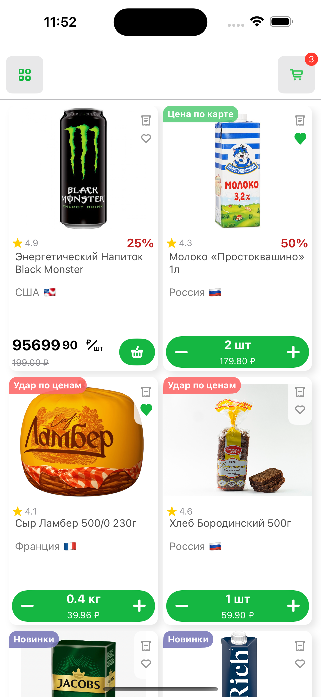
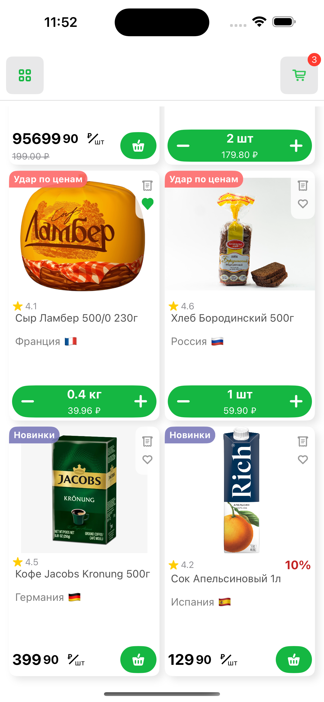
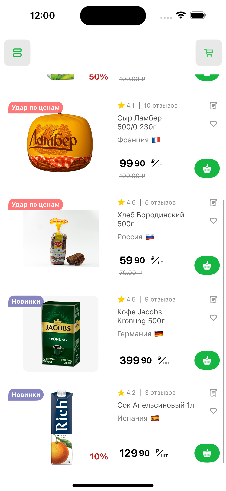
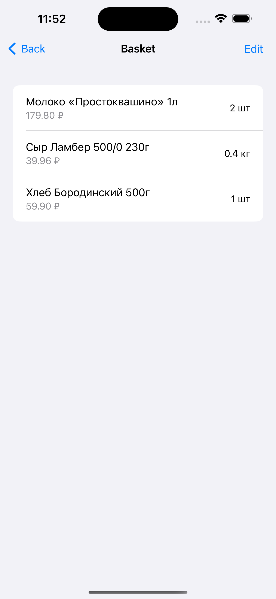

# Тестовое задание на позицию Стажера iOS Разработчика

## Описание

Приложение демонстрирует список товаров в двух режимах отображения:

- **Grid View:** Вид, как сетка товаров.
- **List View:** Вид, как список товаров.

Разработано с использованием фреймворка **SwiftUI** и архитектурного паттерна **MVVM**. Реализована локальная корзина для добавления товаров.

## Скриншоты

### Grid View

<table>
  <tr>
    <td align="center"></td>
    <td align="center"></td>
  </tr>
</table>

### List View

<table>
  <tr>
    <td align="center"></td>
    <td align="center"></td>
    <td align="center"></td>
  </tr>
</table>

### Basket View

<table>
  <tr>
    <td align="center"></td>
  </tr>
</table>
